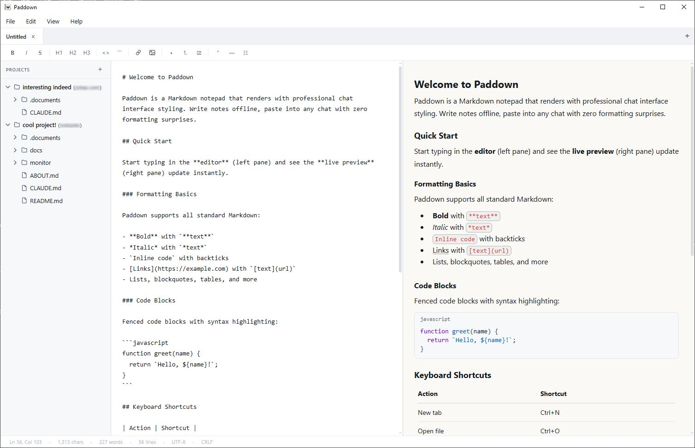

# Paddown

A lightweight, project-oriented Markdown editor that renders with proper chat interface styling. Browse all your `.md` files, write and edit your notes, then paste into your LLM chat or terminal without any formatting surprises.

[](LICENSE)

[Download the latest version](https://github.com/bitlamas/paddown/releases/latest) (all platforms, though I've only tested Windows and Ubuntu via WSL)



## Why Paddown

I built this because I keep a lot of Markdown files around for projects using LLM and couldn't find an editor that wasn't either too heavy or too bare-bones.

**Project sidebar**: Pin folders and browse your `.md` files in a collapsible tree. Filesystem changes are watched in real-time, so it stays in sync without you doing anything.

**Lightweight**: Built on [Tauri v2](https://v2.tauri.app/) using the system's native WebView instead of bundling Chromium like Electron does. The portable exe is ~11 MB, the installer under 3 MB.

**Rendering**: The preview pane is modeled after Claude's chat interface -- similar typography, code blocks, spacing, the works.

## Features

- Split-pane live preview with drag-to-reorder tabs
- Formatting toolbar
- Scroll sync
- HTML and PDF export
- Autosave with crash recovery
- Find & replace, syntax highlighting, dark mode, external file change detection, portable mode, auto-update checker

## Platforms

| Platform | Format |
|---|---|
| Windows | NSIS installer + portable exe |
| Linux | AppImage (not tested) |
| macOS | DMG (not tested) |

## Tech Stack

| Layer | Technology |
|---|---|
| Desktop shell | [Tauri v2](https://v2.tauri.app/) (Rust backend + system WebView) |
| Markdown parser | [marked.js](https://marked.js.org/) v4.3.0 (bundled locally) |
| Frontend | Vanilla HTML / CSS / JS |

No npm, no node_modules, no build step for the frontend.

## Building from Source

You'll need [Rust](https://rustup.rs/) and the [Tauri CLI](https://v2.tauri.app/).

```bash
cargo install tauri-cli --version "^2"
cd src-tauri
cargo tauri build
```

## License

[MIT](LICENSE)